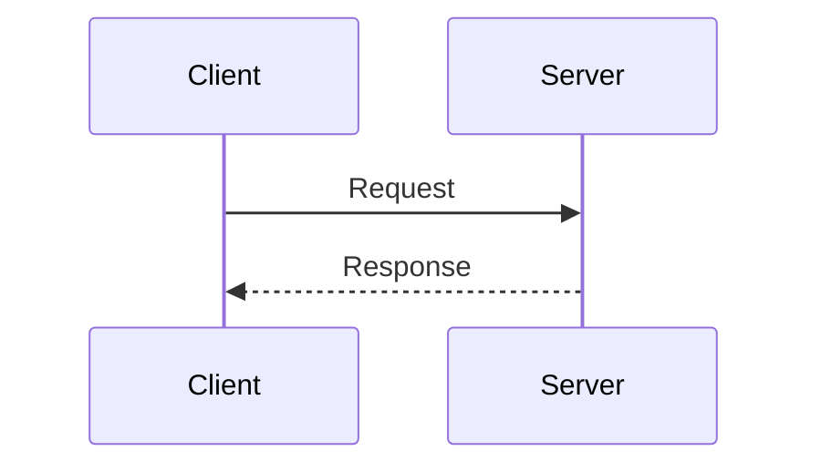

# Practical Architecture

Personal blog at [practical-architecture.com](https://practical-architecture.com) — built with [Hugo](https://gohugo.io) and the [Blowfish](https://blowfish.page) theme, deployed to GitHub Pages via GitHub Actions.

---

## Prerequisites

| Tool | Version | Install |
|---|---|---|
| Hugo Extended | 0.161.1 | `winget install Hugo.Hugo.Extended --version 0.161.1` |
| Go | 1.26+ | already installed |
| Git | any | already installed |

> **Hugo version matters.** Blowfish v2.103.0 requires Hugo 0.158.0–0.161.1. Do not upgrade Hugo without testing the CSS pipeline first.

---

## Local Development

### Start the dev server

```powershell
hugo server -D
```

Opens at http://localhost:1313. The `-D` flag renders draft posts so you can preview them before publishing. Changes hot-reload automatically.

### Build the site locally (production output)

```powershell
hugo --gc
```

Output goes to `public/`. Not needed for day-to-day writing — use `hugo server -D` instead.

### Update the Blowfish theme

```powershell
hugo mod get github.com/nunocoracao/blowfish/v2@latest
hugo mod tidy
```

Test thoroughly after upgrading — theme updates can affect CSS and layouts.

---

## Writing Posts

### Create a new Demystified post

**Conceptual topic** (PQC, Zero Trust, Secret Management, Threat Modeling):

```powershell
hugo new --kind demystified-concept demystified/your-topic-here/
```

**Protocol or system topic** (JWT, OIDC, PKI, Kubernetes, SPIFFE/SPIRE, mTLS):

```powershell
hugo new --kind demystified-protocol demystified/your-topic-here/
```

### Create a new Penny for a Thought post

```powershell
hugo new --kind penny-for-a-thought penny-for-a-thought/your-topic-here/
```

### Post lifecycle

All new posts are created with `draft: true`. They are visible locally (`hugo server -D`) but not in production builds.

**To publish a post**, open its `index.md` and change:

```yaml
draft: true   →   draft: false
```

Then commit and push. GitHub Actions deploys automatically.

> **Date gotcha:** Posts dated in the future will not appear in production builds even if `draft: false`. Always set the date to today or earlier when publishing.

### Post front matter reference

```yaml
---
title: "Your Title Here"
date: 2026-06-04          # publish date — must not be in the future
lastmod: 2026-06-04       # last edited date
draft: false              # true = local preview only, false = live
description: ""           # used in search results and link previews
summary: ""               # shown on list pages and series page
series: ["Demystified"]   # or "Penny for a Thought"
series_order: 1           # position within the series
tags: ["tag1", "tag2"]
categories: ["demystified"]  # or "penny-for-a-thought"
showComments: true
showTableOfContents: true    # set false for opinion posts
showHero: true
heroStyle: "big"             # "big" for Demystified, "basic" for Penny
---
```

### Adding a hero image

Place a file named `featured.jpg` (1200×628px, under 300 KB) in the post's folder alongside `index.md`. Blowfish picks it up automatically as the hero and Open Graph image.

```
content/demystified/your-topic/
├── index.md
└── featured.jpg
```

### Adding a diagram (Demystified — Protocol posts)

Inline Mermaid diagrams render without any extra setup:

````markdown

````

---

## Content Structure

```
content/
├── demystified/          # Technical deep-dives
├── penny-for-a-thought/  # Industry opinion pieces
└── posts/                # Auto-aggregated "Browse All Posts" page (do not add posts here directly)
```

---

## Deployment

Pushing to `main` triggers an automatic GitHub Actions build and deploy to GitHub Pages. No manual steps needed.

**View deploy status:** https://github.com/That1Guy007/practical-architecture/actions

**Live site:** https://practical-architecture.com

The workflow (`deploy.yml`) runs Hugo 0.161.1 Extended, uploads the output to GitHub Pages, and uses `baseURL = https://practical-architecture.com/` from `hugo.toml`.

---

## Git Workflow

```powershell
# Stage specific files
git add content/demystified/your-post/index.md

# Commit
git commit -m "publish: add PQC Demystified post"

# Push (uses SSH key)
git push origin-ssh main
```

### Remotes

| Name | URL | Use |
|---|---|---|
| `origin` | https://github.com/That1Guy007/practical-architecture.git | HTTPS |
| `origin-ssh` | git@that1guy-github:That1Guy007/practical-architecture.git | SSH (preferred) |

### Reverting a bad commit

```powershell
git log --oneline -5          # find the commit hash
git revert <hash> --no-edit   # creates a revert commit (safe, keeps history)
git push origin-ssh main
```

---

## Site Configuration

| File | Purpose |
|---|---|
| `config/_default/hugo.toml` | Base URL, taxonomies, output formats |
| `config/_default/params.toml` | Theme appearance, dark mode, logo, search, article layout |
| `config/_default/languages.en.toml` | Site title, description, author bio and social links |
| `config/_default/menus.en.toml` | Navigation bar and footer links |
| `config/_default/markup.toml` | Markdown rendering, syntax highlighting, Mermaid |
| `assets/css/custom.css` | Custom CSS overrides (nav bar, dropdown, search) |

### Updating your author bio or social links

Edit `config/_default/languages.en.toml`:

```toml
[params.author]
  name     = "Carlos Hernandez"
  headline = "Clear thinking on complex systems"
  bio      = "..."
  links = [
    { linkedin = "https://www.linkedin.com/in/compscicarlos/" },
    { github   = "https://github.com/That1Guy007" },
    { rss      = "/index.xml" },
  ]
```

### Updating the nav logo

Replace `assets/img/blog-emblem-256x256-transparent.png` with a new file, or change the `logo` key in `config/_default/params.toml`:

```toml
logo = "img/blog-emblem-256x256-transparent.png"
```

---

## Cross-Posting Checklist

Before sharing a post on LinkedIn or Medium:

1. Confirm the post is live at `https://practical-architecture.com`
2. Test the link preview using https://www.linkedin.com/post-inspector/
3. Wait 24–48 hours before cross-posting (lets Google index the original first)
4. **Medium:** use *Import Story* with your live post URL — sets canonical automatically
5. **LinkedIn:** paste the post URL in the share box for a link preview, or write a LinkedIn Article and add `Originally published at practical-architecture.com` at the top

---

## Archetypes (Post Templates)

| Command flag | Template | Use for |
|---|---|---|
| `--kind demystified-concept` | Demystified — Conceptual | PQC, Zero Trust, Secret Management, Threat Modeling |
| `--kind demystified-protocol` | Demystified — Protocol | JWT, OIDC, PKI, Kubernetes, SPIFFE/SPIRE, mTLS |
| `--kind penny-for-a-thought` | Penny for a Thought | Industry opinions and takes |
